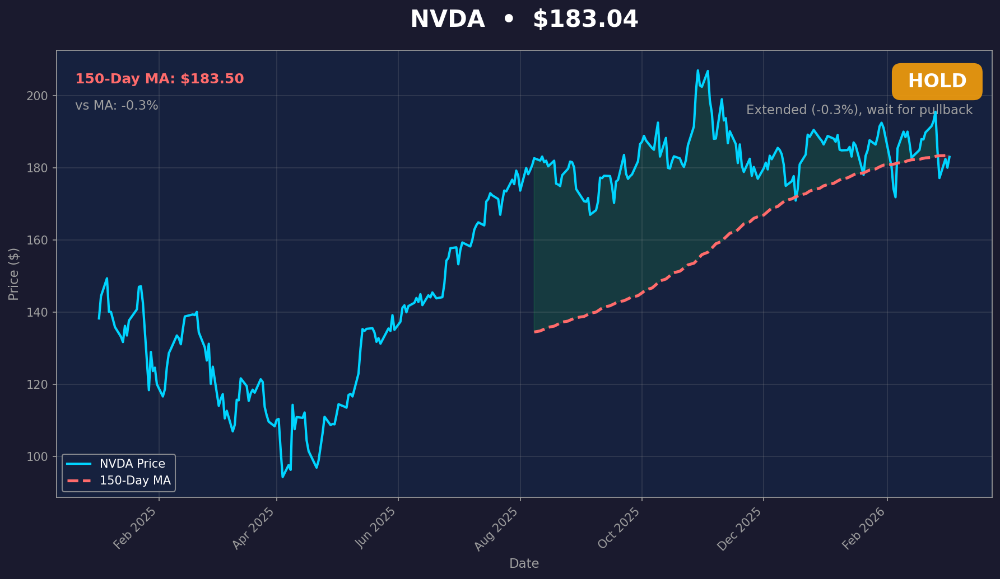

# 📈 StocksMania

A Python-based stock tracker that monitors daily prices, calculates 150-day moving averages, and sends actionable **BUY/SELL recommendations** with charts via Telegram.



## 🎯 What It Does

- **Fetches daily stock prices** from multiple free data sources (Stooq, Yahoo Finance, Alpha Vantage)
- **Calculates 150-day moving averages** - a key technical indicator used by traders
- **Generates individual charts** for each stock with BUY/SELL signals
- **Ranks recommendations** with a scoring system (0-100)
- **Sends daily Telegram reports** with top 3 picks + charts + reasoning
- **Runs automatically** via GitHub Actions (no server needed!)

## 📊 The Strategy

The 150-day moving average is a popular technical indicator. The logic:

| Price vs 150-MA | Signal | Meaning |
|-----------------|--------|---------|
| 0% to +15% | 🟢 **BUY** | Healthy uptrend, good entry |
| +15% to +40% | 🟡 **HOLD** | Extended, wait for pullback |
| > +40% | 🔴 **SELL** | Overbought, take profits |
| < -10% | 🔴 **SELL** | Downtrend, avoid |

## 🏆 Scoring System

Each stock gets a **score out of 100** to help you prioritize:

### BUY Score (higher = better entry)
- **Position**: How close to ideal entry (5% above MA is perfect)
- **Momentum**: Positive daily change adds bonus points

### SELL Urgency (higher = more urgent)
- **Overbought**: How far above 40% threshold
- **Downtrend**: How far below -10% threshold
- **Momentum**: Negative daily change increases urgency

## 📱 Daily Telegram Report

Every day at market close, you receive:

**Header**
```
📈 StocksMania Daily Report
📅 Jan 20, 2026
━━━━━━━━━━━━━━━━━━━━

🟢 BUY signals: 12
🔴 SELL signals: 7
```

**Top 3 BUY with Charts**
```
🟢 ═══ TOP 3 BUY SIGNALS ═══

🥇 #1 BUY: KO
📊 Score: 72/100

💰 Price: $62.86
📈 150-Day MA: $62.13
📉 vs MA: +1.2%
📆 Today: +0.8%

💡 Healthy uptrend at +1.2% above MA. Good entry point.
[Chart attached]

🥈 #2 BUY: JPM ...
🥉 #3 BUY: V ...

🏅 Honorable Mentions (BUY):
  • NVDA - Score: 58 | $136.89 (+5.7%)
  • COST - Score: 45 | $921.62 (+8.3%)
```

**Top 3 SELL with Charts**
```
🔴 ═══ TOP 3 SELL/AVOID ═══

⚠️ #1 SELL: KTOS
🚨 Urgency: 98/100

💰 Price: $130.72
📈 150-Day MA: $73.30
📉 vs MA: +78.3%
📆 Today: +4.9%

⚠️ Overbought at +78.3% above MA. Take profits.
[Chart attached]

⚠️ Also Avoid:
  • PLTR - Urgency: 72 | $117.08 (+60.2%)
  • COIN - Urgency: 65 | $278.11 (-19.0%)
```

**Your Holdings Check + Top Movers**

## 🚀 Quick Start

### 1. Clone the repo

```bash
git clone https://github.com/yanivvi/stocksmania.git
cd stocksmania
```

### 2. Set up Python environment

```bash
python -m venv venv
source venv/bin/activate  # On Windows: venv\Scripts\activate
pip install -r requirements.txt
```

### 3. Create your `.env` file

```bash
# Create .env with your credentials
TELEGRAM_BOT_TOKEN=your_bot_token
TELEGRAM_CHAT_ID=your_chat_id
MY_HOLDINGS=NVDA,AAPL,GOOGL
```

### 4. Fetch historical data

```bash
python main.py initial -s NVDA AAPL MSFT GOOGL
```

### 5. Run the report

```bash
python telegram_notify.py
```

## 💻 CLI Commands

### Fetch Historical Data
```bash
# Single stock
python main.py initial -s NVDA

# Multiple stocks
python main.py initial -s NVDA AAPL MSFT GOOGL AMZN

# Custom date range
python main.py initial -s NVDA --start 2024-01-01

# Custom moving average window
python main.py initial -s NVDA --window 200
```

### Daily Update
```bash
# Update all tracked stocks
python main.py daily -s NVDA AAPL MSFT
```

### View Data
```bash
# Show last 20 days
python main.py show NVDA

# Show last 50 days
python main.py show NVDA -d 50
```

### Generate Charts
```bash
# Display chart
python main.py chart NVDA AAPL

# Save to file
python main.py chart NVDA AAPL --save charts/comparison.png

# With custom MA window
python main.py chart NVDA -w 50
```

### Send Telegram Report
```bash
# Requires TELEGRAM_BOT_TOKEN, TELEGRAM_CHAT_ID, MY_HOLDINGS env vars
python telegram_notify.py
```

## 📁 Project Structure

```
stocksmania/
├── main.py              # CLI entry point
├── stock_fetcher.py     # Data fetching & chart generation
├── telegram_notify.py   # Telegram notifications with scoring
├── config.py            # Configuration
├── providers.py         # Data source providers
├── stocks.txt           # 📋 List of tickers to track
├── requirements.txt     # Dependencies
├── daily_update.sh      # Local cron script
├── add_stock.sh         # Helper to add new stocks locally
├── data/                # Stock price CSVs
│   ├── NVDA_prices.csv
│   ├── AAPL_prices.csv
│   └── ...
├── charts/              # Individual stock charts (auto-generated)
│   ├── NVDA.png
│   ├── AAPL.png
│   └── ...
└── .github/
    └── workflows/
        ├── daily_update.yml  # Daily stock updates
        └── add_stock.yml     # Add new stocks via browser
```

## ⚙️ Configuration

### Environment Variables

| Variable | Description | Example |
|----------|-------------|---------|
| `TELEGRAM_BOT_TOKEN` | Bot token from @BotFather | `123456:ABC...` |
| `TELEGRAM_CHAT_ID` | Your chat ID from @userinfobot | `123456789` |
| `MY_HOLDINGS` | Your stock holdings (comma-separated) | `NVDA,AAPL,GOOGL` |
| `ALPHA_VANTAGE_API_KEY` | Optional API key | `XXXXXXXXXX` |

### GitHub Secrets (for Actions)

Add these in **Settings → Secrets → Actions**:
- `TELEGRAM_BOT_TOKEN`
- `TELEGRAM_CHAT_ID`
- `MY_HOLDINGS`

## 📊 Tracked Stocks

Currently tracking 30 stocks across multiple sectors:

| Sector | Stocks |
|--------|--------|
| **Big Tech** | AAPL, MSFT, GOOGL, AMZN, META, TSLA |
| **Semiconductors** | NVDA, AMD, INTC |
| **AI/Software** | PLTR, CRM |
| **Cybersecurity** | CRWD, PANW |
| **Healthcare** | LLY, NVO |
| **Financials** | JPM, V, COIN |
| **Consumer** | KO, COST, NFLX, SPOT |
| **Industrial** | BA |
| **Defense** | LMT, RTX, NOC, GD, KTOS |
| **Crypto/Other** | MARA, TKO |

## ➕ Adding New Stocks

### Option 1: From Browser (Recommended) 📱

No coding needed! Just use GitHub Actions:

1. Go to [**Actions** → **Add New Stock**](https://github.com/yanivvi/stocksmania/actions/workflows/add_stock.yml)
2. Click **"Run workflow"**
3. Enter tickers: `UBER DIS PYPL`
4. Click **"Run workflow"** ✅

The action will:
- ✅ Fetch historical data
- ✅ Add ticker to `stocks.txt`
- ✅ Commit changes to repo
- ✅ Send you a Telegram confirmation!

### Option 2: Local Script

```bash
./add_stock.sh UBER
# Or multiple:
./add_stock.sh UBER DIS PYPL
```

### Option 3: Manual Steps

```bash
# 1. Fetch historical data
python main.py initial -s UBER

# 2. Add ticker to stocks.txt
echo "UBER" >> stocks.txt

# 3. Commit and push
git add -A && git commit -m "Add UBER" && git push
```

## 🤖 GitHub Actions

Two workflows available:

### Daily Update (Automatic)
- **Schedule**: Every weekday at 6pm Israel time (4pm UTC)
- **Manual**: Can be triggered from Actions tab
- **What it does**:
  1. Fetches latest stock prices
  2. Generates individual charts for all stocks
  3. Sends Telegram report with top 3 BUY/SELL + charts
  4. Commits updated data and charts to repo

### Add New Stock (Manual)
- **Trigger**: Manual only (workflow_dispatch)
- **Input**: Stock tickers (space-separated)
- **What it does**:
  1. Fetches historical data for new stocks
  2. Adds to `stocks.txt`
  3. Commits changes
  4. Sends Telegram confirmation

## 📈 Data Sources

Tries multiple providers with fallback:
1. **Stooq** - Free, full historical data
2. **Alpha Vantage** - Free tier (100 days)
3. **Yahoo Finance** - Backup

## 🛠️ Local Cron Setup (Optional)

If you prefer running locally instead of GitHub Actions:

```bash
# Make script executable
chmod +x daily_update.sh

# Add to crontab (runs at 6pm on weekdays)
crontab -e
# Add: 0 18 * * 1-5 /path/to/stocksmania/daily_update.sh
```

## 📜 License

MIT License - feel free to use and modify!

## ⚠️ Disclaimer

**This is not financial advice.** This tool is for educational and informational purposes only. Always do your own research before making investment decisions. Past performance does not guarantee future results.

---

Made with ❤️ and Python
